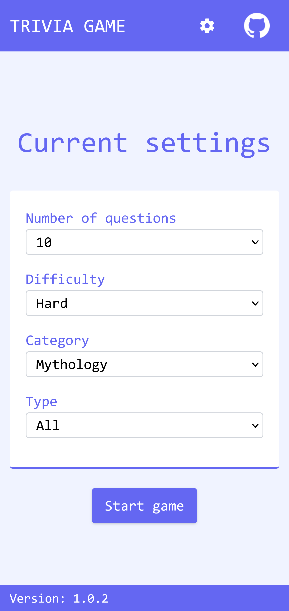
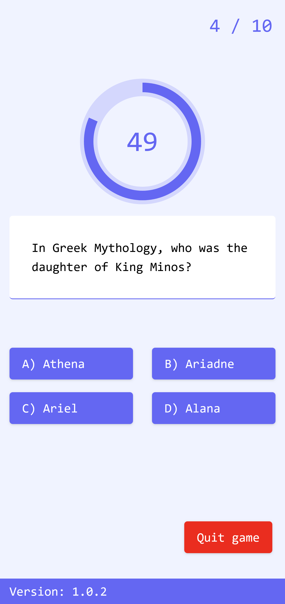
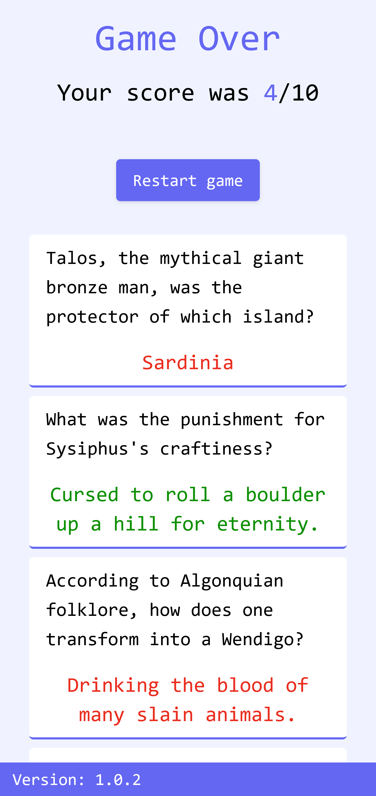

  <h1> Open Trivia Game</h1>

  

  A Single player Quiz game with questions provided by <a href="https://opentdb.com" rel="nofollow">Open TDB</a>.
  

  <h2>
    <a href="https://gitchaoslord.github.io/open-trivia-game/" rel="nofollow">Play now!</a>
  </h2>

This project was initially based on a [tutorial](https://www.youtube.com/watch?v=C9g-Zhsd_FE) by Raul Terhes in order to get familiar with Redux-Toolkit and React. I decided to forgo the use of Redux Saga as i felt it overcomplicated things and also added TypeScript.
I added additional functionality, in the form of difficulty, number of question selection, etc. and saving app-state to localstorage.

Eventually, i've turned this project into a sort of playground, converting it from [Create React App](https://github.com/facebook/create-react-app) to [Vite](https://vitejs.dev/), checking redux middleware functionality and adding a various bits of knowledge i've accrued over-time.

  <h2>Screenshots</h2>
  <picture>
    <source media="(prefers-color-scheme: dark)" srcset="./screenshots/dark-mobile-start.png">
    
  </picture>
  <picture>
    <source media="(prefers-color-scheme: dark)" srcset="./screenshots/dark-mobile-playing.png">
    
  </picture>
  <picture>
    <source media="(prefers-color-scheme: dark)" srcset="./screenshots/dark-mobile-end.png">
    
  </picture>

